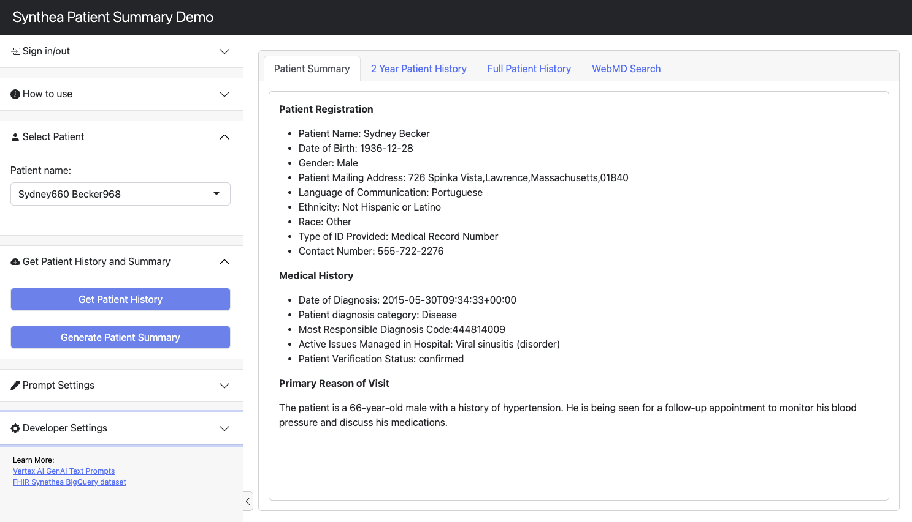

# Vertex Generative AI Patient Summary Demo

## Overview

A demo application for summarizing synthetic patient medical records data, uses the [FHIR Synthea BigQuery Public Dataset](https://console.cloud.google.com/marketplace/product/mitre/synthea-fhir) and [Vertex AI > GenAI Text](https://cloud.google.com/vertex-ai/docs/generative-ai/text/test-text-prompts). The application is deployed on Cloud Run and the frontend UI is built with [R](https://cran.r-project.org) and [Shiny](https://shiny.posit.co/).



## Dataset

The data used in this demo is 100% synethetic and public: [FHIR Synthea BigQuery Public Dataset](https://console.cloud.google.com/marketplace/product/mitre/synthea-fhir) A single synethetic field  `primary_reason_of_visit`  was manually generated/joined for demo purposes and it is included in [/data/patient_primary_reason.csv](/data/patient_primary_reason.csv). This repo includes code to upload the data to BigQuery as part of creating the tables for the demo app.

## Setup local environment

### Install dependencies

Install the following if not using an authenticated environment (e.g. - a Vertex AI Workbench Notebook instance)

* [Cloud SDK](https://cloud.google.com/sdk) - gcloud SDK to run the commands below
* [R > Download Mirrors](https://cran.r-project.org/mirrors.html) - to download and install R (for local dev and testing if needed)

### Create local secrets file (.secrets.R)

Run [01_create_secrets_file.sh](01_create_secrets_file.sh) to create a secrets file:  `./secrets/.secrets.R`

```sh
sh 01_create_secrets_file.sh
```

## Setup GCP Project

### Before you begin

The following steps are required, regardless of your environment:

1. [Select or create a Google Cloud project](https://console.cloud.google.com/cloud-resource-manager). When you first create an account, you get a $300 free credit towards your compute/storage costs.
2. [Make sure that billing is enabled for your project](https://cloud.google.com/billing/docs/how-to/modify-project).
3. Have the project ID handy and enter it in the next command below to authenticate.

### Authenticate

Authenticate with Google Cloud via the SDK, set the proper project and then set your [Application Default Credentails](https://cloud.google.com/docs/authentication/provide-credentials-adc) to ensure the proper credentials are used in the rest of the steps.

```sh
gcloud auth login
gcloud config set project <YOUR-PROJECT-ID>
gcloud auth application-default login
```

### Set constants

As global environment variables here for re-use throughout the rest of the steps

```sh
PROJECT_ID=$(gcloud config get-value project)
PROJECT_NUMBER=$(gcloud projects describe $(gcloud config get-value project) --format='value(projectNumber)')
REGION="us-central1"
SVC_ACCOUNT_NAME="patient-summary"
SVC_ACCOUNT_EMAIL="$SVC_ACCOUNT_NAME@$PROJECT_ID.iam.gserviceaccount.com"
DOCKER_REPO="patient-summary"
IMAGE_NAME="patient-summary"
IMAGE_TAG="latest"
IMAGE_URI="$REGION-docker.pkg.dev/$PROJECT_ID/$DOCKER_REPO/$IMAGE_NAME:$IMAGE_TAG"
SERVICE_NAME="patient-summary"
SECRET_NAME="patient-summary-secrets"
SOURCE_REPO_NAME="vertex-gen-ai-patient-summary-demo"
```

### Enable APIs

```sh
gcloud services enable \
    bigquery.googleapis.com \
    cloudbuild.googleapis.com \
    artifactregistry.googleapis.com \
    run.googleapis.com \
    secretmanager.googleapis.com
```

### Create Service account

And grant access to resources except secrets manager (which we will create and grant access to
in a later step below)

```sh
gcloud iam service-accounts create $SVC_ACCOUNT_NAME \
    --description="For deploying patient summary demo app on Cloud Run" \
    --display-name="patient summary demo app service account"

gcloud projects add-iam-policy-binding $PROJECT_ID \
    --member="serviceAccount:$SVC_ACCOUNT_NAME@$PROJECT_ID.iam.gserviceaccount.com" \
    --role="roles/bigquery.dataViewer"

gcloud projects add-iam-policy-binding $PROJECT_ID \
    --member="serviceAccount:$SVC_ACCOUNT_NAME@$PROJECT_ID.iam.gserviceaccount.com" \
    --role="roles/bigquery.jobUser"

gcloud projects add-iam-policy-binding $PROJECT_ID \
    --member="serviceAccount:$SVC_ACCOUNT_NAME@$PROJECT_ID.iam.gserviceaccount.com" \
    --role="roles/bigquery.user"

gcloud projects add-iam-policy-binding $PROJECT_ID \
    --member="serviceAccount:$SVC_ACCOUNT_NAME@$PROJECT_ID.iam.gserviceaccount.com" \
    --role="roles/aiplatform.user"
```

Note: for even stricter access, use a custom role for Gen AI prediction requests.

See: <https://cloud.google.com/vertex-ai/docs/generative-ai/access-control>

## Setup Firebase

### Create a Firebase project

1. Create a Google firebase account if you do not already have one; head to [firebase.google.com](https://firebase.google.com/), and set up your account.
2. After you've created your account or navigate to [firebase.google.com](https://firebase.google.com/), you'll see a "Welcome to Firebase" screen.
3. Click "Create project" and follow the steps (give your project a name and choose yes/no for Google Analytics. the latter can be changed later)
4. After an intermediary screen, you'll see the project screen (below). Click the “web” icon (highlighted in red).


5. Set a name your app on the next screen, then hit “Register app” (Note: a Firebase project shares sign-in users and can be comprised of different apps iOS, web, etc.)
6. Navigate to "Authentication" on the left sidebar and then click "Set up sign-in" method
7. Enable Email/password
8. Then click "Users" tab at the top and create a user for yourself. use an accessible email and note the password (you can delete/re-create yourself as needed so no worries if you need to re-do this later)

Configuring Firebase further is out of scope of this repository, the basic steps are included here for end-to-end demonstration purposes only. This demo does not offer production grade security, please consult with a Google Cloud for additional help if want to deploy this into production.

### Save Firebase API credentails to .secrets.R file

1. In top left of Firebase console, click the gear icon and then "Project Settings"
2. Scroll down to the "Your Apps" section and find the `SDK setup and configuration` section
3. Replace the `<YOUR-VALUE-HERE>` values below in the `.secrets.R` file in this repository (note: DO NOT include this in git, it is ignored by default)
   1. FIREBASE_API_KEY="<YOUR-VALUE-HERE>"
   2. FIREBASE_PROJECT_ID="<YOUR-VALUE-HERE>"
   3. FIREBASE_AUTH_DOMAIN="<YOUR-VALUE-HERE>"
   4. FIREBASE_STORAGE_BUCKET="<YOUR-VALUE-HERE>"
   5. FIREBASE_APP_ID="<YOUR-VALUE-HERE>"

## Create BigQuery data

Create BQ tables from the public FHIR BigQuery dataset with [02_create_bq_tables.Rmd](02_create_bq_tables.Rmd)

You can run the queries 1-by-1 from the BigQuery UI or your interface of choice.

Or you can run all the queries within the (Rmd) file:

```sh
Rscript -e "rmarkdown::render('02_create_bq_tables.Rmd')"
```

## Upload secrets file to secrets manager

For secure deployment to Cloud Run, we use secrets manager. We use this appraoch since Shiny and Shiny Server are not able to access environment variables by design.

### Confirm secrets file locally updated

Confirm secrets file locally updated with arguments for both GCP and Firebase before uploading to secrets managaer.

### Create secret in secret manager

Create a secret from the local file we just confirmed correct.

```sh
gcloud secrets create $SECRET_NAME \
    --replication-policy="automatic" \
    --data-file=./secrets/.secrets.R
```

and then grant service account access to the secret

```sh
gcloud secrets add-iam-policy-binding $SECRET_NAME \
    --member="serviceAccount:$SVC_ACCOUNT_NAME@$PROJECT_ID.iam.gserviceaccount.com" \
    --role="roles/secretmanager.secretAccessor"
```

<https://cloud.google.com/secret-manager/docs/create-secret-quickstart#secretmanager-quickstart-gcloud>

## Build Image

### Create Artifact Registry (docker repository)

Create an Artifact Registry (AR) repository (repo) to serve as our docker repository. 

Running the code below will check if the repo exists first and create only if it does not exist.

```sh
## Create artifact registry only if it does not already exist
# Check if the repository already exists
if gcloud artifacts repositories describe $DOCKER_REPO --location=$REGION &> /dev/null; then
  echo "Repository $DOCKER_REPO already exists:"
  gcloud artifacts repositories describe $DOCKER_REPO --location=$REGION
else
  # Create the repository if it doesn't exist
  echo "Respository does not exist. Creating...."
  gcloud artifacts repositories create $DOCKER_REPO \
    --repository-format=docker \
    --location=$REGION \
    --description="Docker repository for patient summary demo app"
  echo "Repository created."
  gcloud artifacts repositories describe $DOCKER_REPO --location=$REGION
fi 
```

### Configure auth

```sh
gcloud auth configure-docker $REGION-docker.pkg.dev --quiet
```

### Build container iamge

Build our container image in Cloud Build using the supplied Dockerfile

```sh
gcloud builds submit --region=$REGION --tag=$IMAGE_URI --timeout=1h ./build
```

## Deploy

### Deploy to Cloud Run

Once the image is finished building (~3-5mins), deploy to Cloud Run

```sh
gcloud run deploy $SERVICE_NAME \
  --image $IMAGE_URI \
  --region=$REGION \
  --platform="managed" \
  --port="5000" \
  --allow-unauthenticated \
  --session-affinity \
  --service-account=$SVC_ACCOUNT_EMAIL \
  --min-instances=0 \
  --max-instances=5 \
  --set-secrets="/secrets/.secrets.R=${SECRET_NAME}:latest"
```

### Add Cloud Run hostname to Firebase Allowed Domains

Add the full url to firebase allowed domains. Wait a min or two if you can. Then try loging in to the app with the user you created in Firebase earlier.

## Optional: Setup CI/CD Pipeline

Optionally, we create a CI/CD pipeline for easier deployment. An overview can be found [here](https://cloud.google.com/build/docs/deploying-builds/deploy-cloud-run) and additional refereences below.

### Create cloudbuild.yaml file

A file has been created for you, see `cloudbuild.yaml` file in the root of this project's directory.

### Create source repo

Create a Cloud Source Repository in your project and will be used by a Build Trigger we will create next.

```sh
gcloud source repos create $SOURCE_REPO_NAME
```

Then push your local repo to the newly created cloud source repo via `git push --all google` to confirm the configuration.

#### Setup local authentication for source repos

Follow instructions for local authentication [here](https://cloud.google.com/source-repositories/docs/authentication) based on your environemnt. For more on manually created crentails, see this [section](https://cloud.google.com/source-repositories/docs/authentication#manually-generated-credentials) and below:

* <https://cloud.google.com/source-repositories/docs/creating-an-empty-repository>
* <https://cloud.google.com/source-repositories/docs/create-code-repository>
* <https://cloud.google.com/sdk/gcloud/reference/source/repos/create>

### Create build trigger

Create a build trigger that will use the `cloudbuild.yaml` included with this repo.

```sh
gcloud beta builds triggers create cloud-source-repositories \
  --name=$BUILD_TRIGGER_NAME \
  --repo=$SOURCE_REPO_NAME \
  --branch-pattern="^main$" \
  --build-config=cloudbuild.yaml \
  --region=$REGION
```

<https://cloud.google.com/sdk/gcloud/reference/beta/builds/triggers/create/cloud-source-repositories>

#### Grant default cloud build service account access

Grant cloud build service account permission to push to cloud run service

```sh
gcloud run services add-iam-policy-binding $SERVICE_NAME \
  --member="serviceAccount:$PROJECT_NUMBER@cloudbuild.gserviceaccount.com" \
  --role=roles/run.admin \
  --region=$REGION
```

* <https://cloud.google.com/build/docs/cloud-build-service-account>
* <https://cloud.google.com/build/docs/deploying-builds/deploy-cloud-run#continuous-iam>

### Test deployment

Now push a commit to the recently created source repository to test the workflow end-to-end.

The image should be automatically built by Cloud Build and then deployed to Cloud Run.

## Cleanup

To cleanup and delete the resources created in this demo, run the commands below.

### Cleanup Google Cloud

```sh
# gcloud run services delete $SERVICE_NAME  --region=$REGION
# gcloud artifacts repositories delete $DOCKER_REPO --region=$REGION
# gcloud secrets delete $SECRET_NAME
# gcloud alpha bq datasets delete fhir_synthea_patient_summary --remove-tables
# gcloud iam service-accounts delete $SVC_ACCOUNT_EMAIL
```

<https://cloud.google.com/sdk/gcloud/reference/alpha/bq/datasets/delete>

### Cleanup Firebase

Delete your Firebase project by following the steps outlined [here](https://support.google.com/firebase/answer/9137886?hl=en)

### Cleanup Google Cloud - CI/CD 

To delete the resources created for the optional CI/CD pipeline, run the following:

```sh
# gcloud builds triggers delete $BUILD_TRIGGER_NAME --project=$PROJECT_ID --region=$REGION
# gcloud source repos delete $SOURCE_REPO_NAME
```
